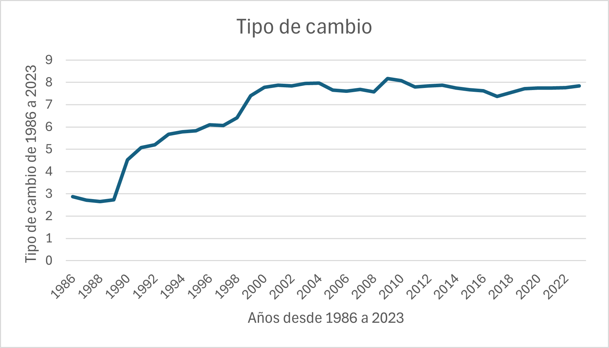

```{r setup, include=FALSE}
knitr::opts_chunk$set(echo = TRUE)
```

# Regímenes cambiarios y tipo de cambio en Guatemala


```{r,out,width="150", fig.align="center"}
  
```

## Registros extraídos de la década de 1980´s

Durante gran parte de los años 80, Guatemala mantuvo un régimen de tipo de cambio fijo con una fuerte intervención del Banco de Guatemala. En este sistema, el tipo de cambio era determinado administrativamente y no respondía a las fuerzas del mercado. Este modelo buscaba controlar la inflación y dar estabilidad al comercio internacional. Sin embargo, enfrentó fuertes tensiones debido a desequilibrios fiscales, inflación interna, y la presión sobre las reservas internacionales. La escasez de divisas derivó en mercados paralelos y distorsiones económicas, debilitando la efectividad del control cambiario.

## Registros extraídos de la década de 1990´s

A partir de la década de los 90, y en el marco de reformas estructurales impulsadas por el consenso de Washington y el FMI, Guatemala comenzó una transición hacia una mayor flexibilidad cambiaria. En 1991, se desmanteló el control de cambios y se estableció un régimen de flotación administrada, donde el tipo de cambio comenzó a ser determinado por la oferta y la demanda en el mercado cambiario, aunque el Banco de Guatemala conservó la capacidad de intervenir para evitar movimientos bruscos.

Durante esta década también se liberalizaron los flujos de capital y se promovió un mayor desarrollo del mercado financiero, con el objetivo de hacer más eficiente la asignación de recursos y mejorar la competitividad externa.

## Registros extraídos de la década de 2000´s a la actualidad

Desde el año 2001, Guatemala ha mantenido un régimen de flotación administrada (managed float), en el cual el tipo de cambio se determina en el mercado cambiario, pero el banco central interviene ocasionalmente para evitar una excesiva volatilidad o movimientos especulativos. Este régimen ha permitido una mayor estabilidad cambiaria, con variaciones relativamente controladas del tipo de cambio nominal, gracias a políticas macroeconómicas prudentes, acumulación de reservas internacionales y un entorno inflacionario moderado.

A diferencia de los regímenes de tipo de cambio fijo o flotación libre, el esquema actual busca equilibrar la flexibilidad del mercado con mecanismos de corrección para preservar la estabilidad financiera. El tipo de cambio del quetzal frente al dólar ha mostrado una depreciación lenta y progresiva, pero sin episodios de crisis severas.

Este enfoque ha sido clave para mantener la confianza de los inversionistas y facilitar el crecimiento del comercio exterior. No obstante, también ha generado debates sobre la posible sobrevaloración del tipo de cambio real y su impacto sobre la competitividad de las exportaciones.

