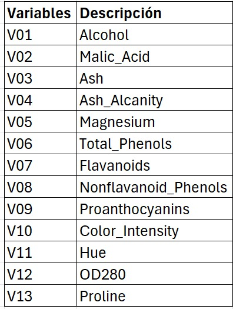

```{r setup, include=FALSE}
knitr::opts_chunk$set(echo = TRUE)
library(readxl)
library(psych)
library(ggplot2)
```

# Introducción


# Marco Teórico


## Variables

```{r}
# Carga de datos
dataset <- read.csv("cancer_patients.csv")
dataset.df <- data.frame(dataset)
head(dataset.df)
```


```{r,out,width="150", fig.align="center"}
  
```


## Correlación de variables

```{r}
round(cor(dataset.df),2)
```


# Analisis de Componenentes Principales

```{r}

```

```{r}
scree(dataset.df, factors = TRUE)
```

### Determinación de cantidad de componentes


```{r}

```

# Conclusiones e interpretacion de resultados:


## Bibliografía

- Dataset específico: Cancer Cases Report In all the World in las 10 Years. (2024). Recuperado de https://www.kaggle.com/datasets/zahidmughal2343/global-cancer-patients-2015-2024?resource=download.

