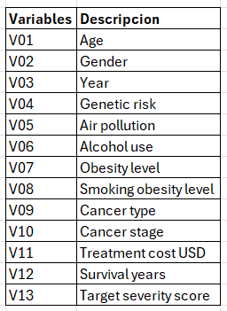

```{r setup, include=FALSE}
knitr::opts_chunk$set(echo = TRUE)
library(psych)
library(factoextra)

```

# Introducción


# Marco Teórico


El análisis de componentes principales (PCA) es una técnica estadística utilizada para reducir la dimensionalidad de un conjunto de datos, identificando las variables más relevantes que explican la mayor parte de la variabilidad en los datos. Esta técnica es especialmente útil cuando se trabaja con conjuntos de datos grandes y complejos, ya que permite simplificar el análisis y facilitar la interpretación de los resultados.


## Variables

```{r}
# Carga de datos
dataset <- read.csv("cancer_patients.csv")
head(dataset)
```


```{r,out,width="150", fig.align="center"}
  
```

# Analisis de Componenentes Principales

```{r}
ACP.1 <- princomp(dataset)
ACP.2 <- princomp(dataset, cor = TRUE)
eigen(cor(dataset))
```

### Determinación de cantidad de componentes
```{r}
summary(ACP.1)
summary(ACP.2)

loadings(ACP.1)
loadings(ACP.2)

fviz_eig(ACP.1, 
         addlabels = TRUE, 
         hline = c(yintercept = 1, linetype = "dashed")) +
  labs(title = "Scree Plot (Regla de Kaiser)")
```


# Conclusiones e interpretacion de resultados:


## Bibliografía

- Dataset específico: Cancer Cases Report In all the World in las 10 Years. (2024). Recuperado de https://www.kaggle.com/datasets/zahidmughal2343/global-cancer-patients-2015-2024?resource=download.

