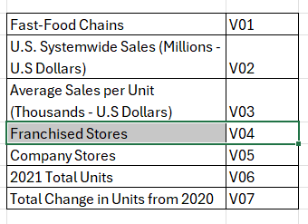

```{r setup, include=FALSE}
knitr::opts_chunk$set(echo = TRUE)
library(psych)
library(factoextra)

```

# Introducción


# Marco Teórico


El análisis de componentes principales (PCA) es una técnica estadística utilizada para reducir la dimensionalidad de un conjunto de datos, identificando las variables más relevantes que explican la mayor parte de la variabilidad en los datos. Esta técnica es especialmente útil cuando se trabaja con conjuntos de datos grandes y complejos, ya que permite simplificar el análisis y facilitar la interpretación de los resultados.


## Variables

```{r}
# Carga de datos
dataset <- read.csv("fast_food.csv")
rownames(dataset) <- dataset[,1]
dataset <- dataset[,-1]
head(dataset)
```


```{r,out,width="150", fig.align="center"}
  
```

# Analisis de Componenentes Principales

```{r}
pc <- principal(dataset, nfactors=1)
pc
```


##  Determinacion de cantidad de componentes principales
```{r}
fa.parallel(dataset, n.obs=302, fa="pc", n.iter=100,
            show.legend=FALSE, main="Scree plot with parallel analysis")
```

### Interpretacion:

La grafica scree plot muestra la cantidad de componentes principales que explican la varianza en los datos. En este caso, se observa que los primeros dos componentes explican la mayor parte de la varianza, lo que sugiere que estos son los más relevantes para el análisis.

## ACP con dos componentes
```{r}
PC <- principal(dataset, nfactors=2, rotate="none")
PC
rc <- principal(dataset, nfactors=2, rotate="varimax")
rc
round(unclass(rc$weights),2)
```

ACP
Z1= 0.45V02 + 0.13V03 + 0.19V04 + 0.33V05 + 0.29V06 + 0.18V07
Z2= 0.14V02 + 0.33V03 - 0.30V04 + 0.20V05 - 0.21V06 + 0.45V07

Z1 es el primer componente principal, que representa la dimesion de escala operativa, la z02 explica la dimension de rendimiento y crecimiento de las cadenas de comida rapida en Estados Unidos. PC1 explica el 46% de la varianza y representa fundamentalmente el tamaño total de la operacion, por otra parte PC2 explica el 27% adicional de la varianza (73% acumulado).


```{r}

ACP.1 <- princomp(dataset)
ACP.2 <- princomp(dataset, cor = TRUE)

summary(ACP.1)
summary(ACP.2)

loadings(ACP.1)
loadings(ACP.2)

biplot(ACP.1)
abline(h=0,col="blue")
abline(v=0,col="blue")
grid()

biplot(ACP.2)
abline(h=0,col="blue")
abline(v=0,col="blue")
grid()
```


# Conclusiones e interpretacion de resultados:


## Bibliografía

- Dataset específico: Cancer Cases Report In all the World in las 10 Years. (2024). Recuperado de https://www.kaggle.com/datasets/zahidmughal2343/global-cancer-patients-2015-2024?resource=download.

